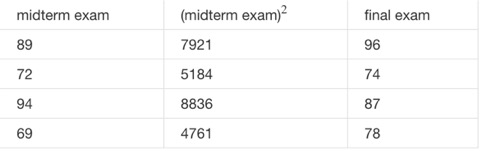

###### 一、Suppose m=4 students have taken some class, and the class had a midterm exam and a final exam. You have collected a dataset of their scores on the two exams, which is as follows:  

  

###### You'd like to use polynomial regression to predict a student's final exam score from their midterm exam score. Concretely, suppose you want to fit a model of the form hθ(x)=θ0+θ1x1+θ2x2, where x1 is the midterm score and x2 is (midterm score)2. Further, you plan to use both feature scaling (dividing by the "max-min", or range, of a feature) and mean normalization. What is the normalized feature x(1)1? (Hint: midterm = 89, final = 96 is training example 1.) Please round off your answer to two decimal places and enter in the text box below.

anwser: 0.31

###### 二、run gradient descent for 15 iterations with α=0.3 and compute J(θ) after each iteration. You find that the value of J(θ) increases over time. Based on this, which of the following conclusions seems most plausible?

1. α=0.3 is an effective choice of learning rate.

2. Rather than use the current value of α, it'd be more promising to try a larger value of α (say α=1.0).
3. Rather than use the current value of α, it'd be more promising to try a smaller value of α (say α=0.1).

##### answers: 3

######三、Suppose you have m=14 training examples with n=3 features (excluding the additional all-ones feature for the intercept term, which you should add). The normal equation is θ=(XTX)−1XTy. For the given values of m and n, what are the dimensions of θ, X, and y in this equation?
1. X is 14×3, y is 14×1, θ is 3×1
2. X is 14×4, y is 14×4, θ is 4×4
3. X is 14×3, y is 14×1, θ is 3×3
4. X is 14×4, y is 14×1, θ is 4×1

##### answers: 4

######四、Suppose you have a dataset with m=50 examples and n=15 features for each example. You want to use multivariate linear regression to fit the parameters θ to our data. Should you prefer gradient descent or the normal equation?
1. The normal equation, since gradient descent might be unable to find the optimal θ.
2. Gradient descent, since it will always converge to the optimal θ.
3. Gradient descent, since (X‘X)−1 will be very slow to compute in the normal equation.
4. The normal equation, since it provides an efficient way to directly find the solution.

##### answers: 4

######五、Which of the following are reasons for using feature scaling?
1. It is necessary to prevent gradient descent from getting stuck in local optima.
2. It speeds up gradient descent by making it require fewer iterations to get to a good solution.
3. It prevents the matrix XTX (used in the normal equation) from being non-invertable (singular/degenerate).
4. It speeds up solving for θ using the normal equation.

##### answer: 2