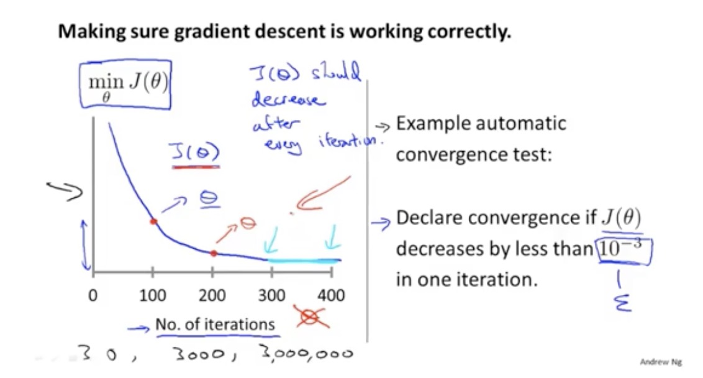
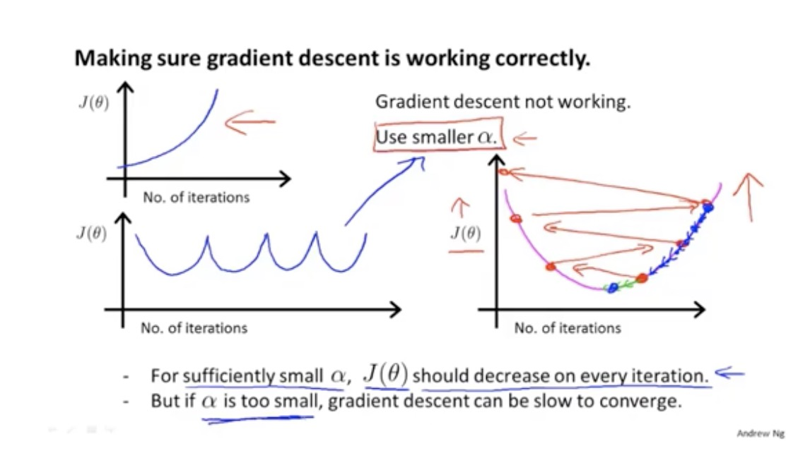

##笔记
如果需要看随机梯度下降的快慢或者是经过多少次迭代之后就不需要在继续进行迭代了。这时候可以通过绘出损失函数来看出。

如果由于alpha选择不恰当的话，就会出现下面的这些情况。

总结：   

1. 如果alpha选择的太小，将会收敛很慢.   
2. 如果alpha选择的太大，损失函数在每一次的迭代中有可能不会减小，或者是有可能不会收敛  

选择alpha可以尝试以下这些值，这些都是经常使用的。
……,0.001,0.003,0.01,0.03,0.1,0.3……  

###随机梯度下降和正规方程的比较：m（training examples） n（features）  
####随机梯度下降  
  
1. 需要选择alpha  
2. 需要很多迭代  
3. 即使n很大也能很好的工作

####正规方程

1. 不需要选择alpha  
2. 不需要进行迭代，只需要计算出theta即可。前提是（T‘T）是可逆的  
3. n比较下的时候，时候用正规方程，比如n=100，n=1000，当n=10000的时候，往往要倾向选择随机梯度下降算法
4. 当n很大的时候，对于计算（T’T）的逆，所要花费的时间是很大的O(n3),会很慢

