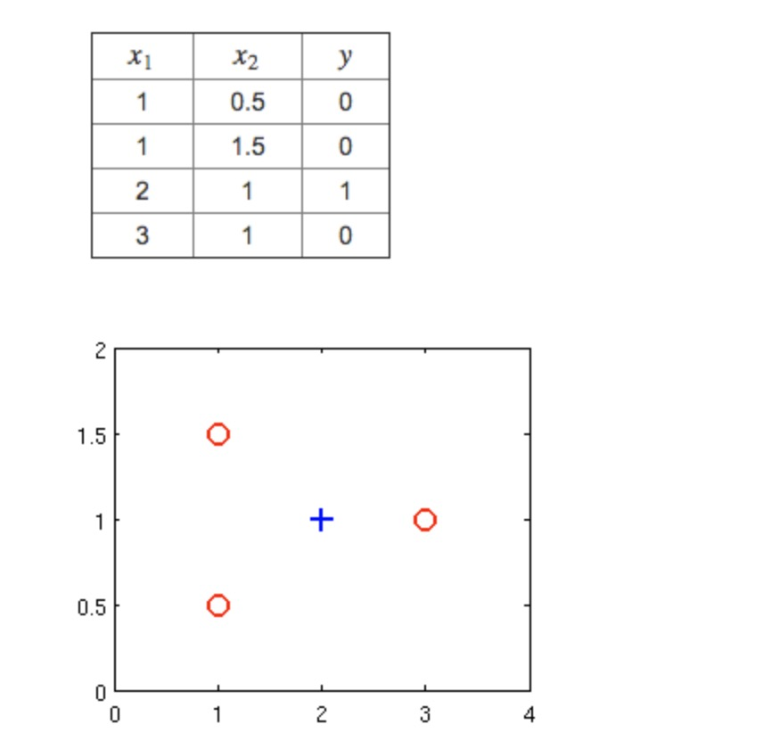
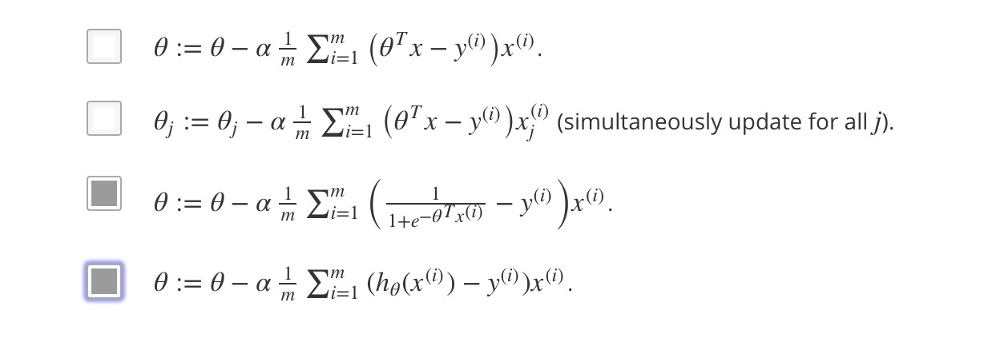
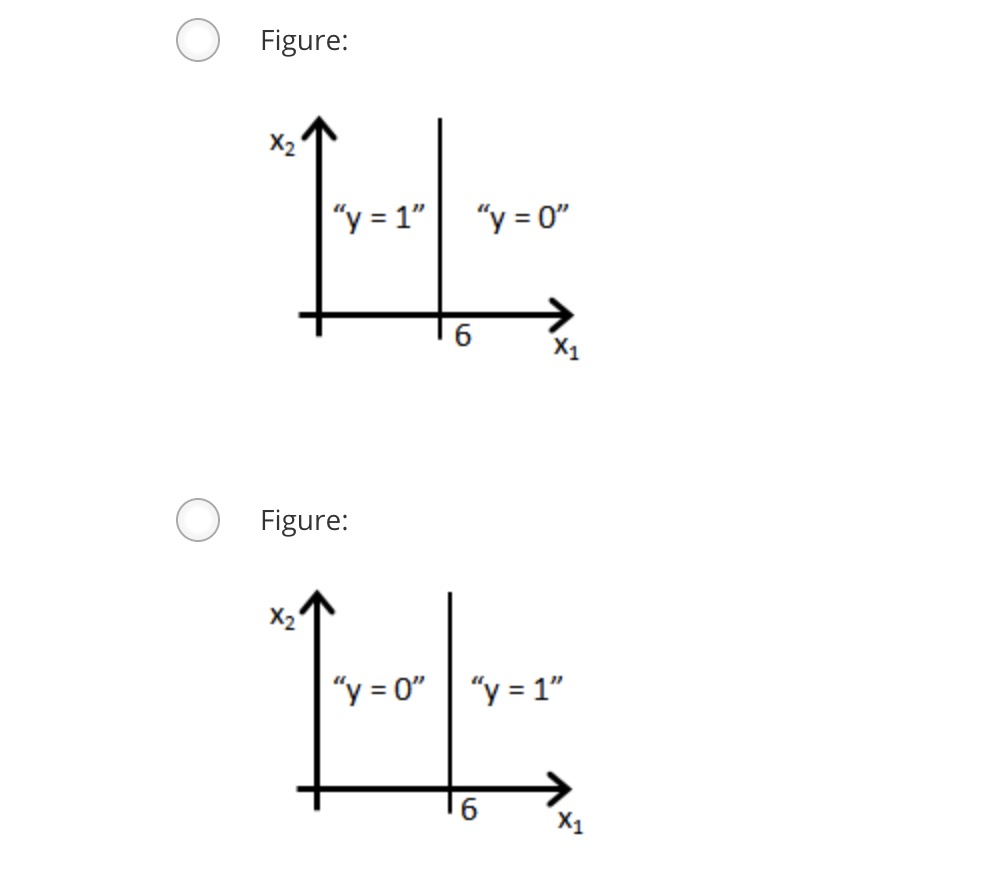
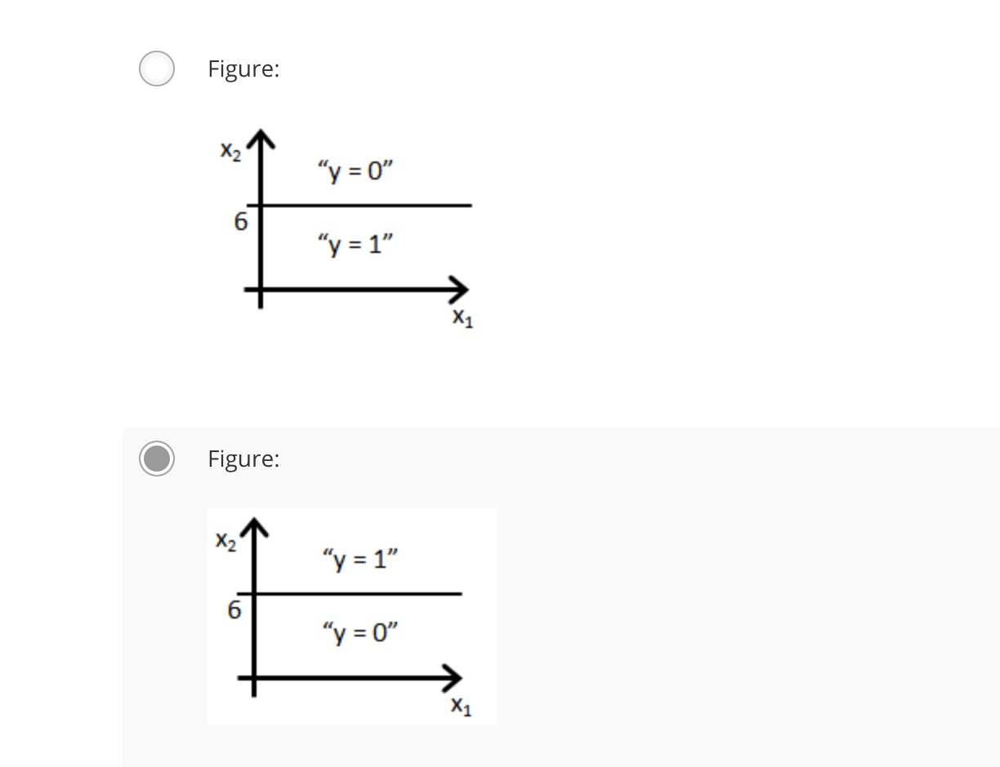

##logistic regression

一、Suppose that you have trained a logistic regression classifier, and it outputs on a new example x a prediction hθ(x) = 0.7. This means (check all that apply):

	1、Our estimate for P(y=0|x;θ) is 0.7.
	2、Our estimate for P(y=0|x;θ) is 0.3.
	3、Our estimate for P(y=1|x;θ) is 0.3.
	4、Our estimate for P(y=1|x;θ) is 0.7.

answers：4，2

二、Suppose you have the following training set, and fit a logistic regression classifier hθ(x)=g(θ0+θ1x1+θ2x2).
Which of the following are true? Check all that apply.

	1、J(θ) will be a convex function, so gradient descent should converge to the global minimum.  
	2、Adding polynomial features (e.g., instead using   hθ(x)=g(θ0+θ1x1+θ2x2+θ3x21+θ4x1x2+θ5x22) ) could increase how well we can fit the training data.  
	3、The positive and negative examples cannot be separated using a straight line. So, gradient descent will fail to converge.  
	4、Because the positive and negative examples cannot be separated using a straight line, linear regression will perform as well as logistic regression on this data.

answers：1，2

三、For logistic regression, the gradient is given by ∂∂θjJ(θ)=1m∑mi=1(hθ(x(i))−y(i))x(i)j. Which of these is a correct gradient descent update for logistic regression with a learning rate of α? Check all that apply.

answers：3，4

四、Which of the following statements are true? Check all that apply.

	1. The sigmoid function g(z)=1／1+e−z is never greater than one (>1).
	2. The cost function J(θ) for logistic regression trained with m≥1 examples is always greater than or equal to zero.
	3. Linear regression always works well for classification if you classify by using a threshold on the prediction made by linear regression.
	4. For logistic regression, sometimes gradient descent will converge to a local minimum (and fail to find the global minimum). This is the reason we prefer more advanced optimization algorithms such as fminunc (conjugate gradient/BFGS/L-BFGS/etc).
	
answers：1，2

五、Suppose you train a logistic classifier hθ(x)=g(θ0+θ1x1+θ2x2). Suppose θ0=−6,θ1=0,θ2=1. Which of the following figures represents the decision boundary found by your classifier?

