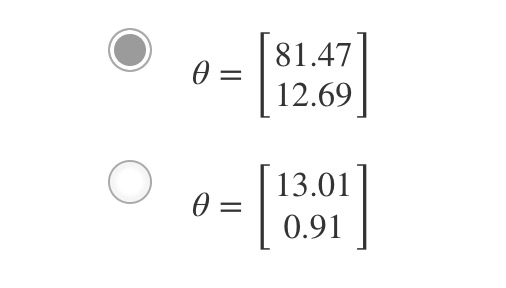
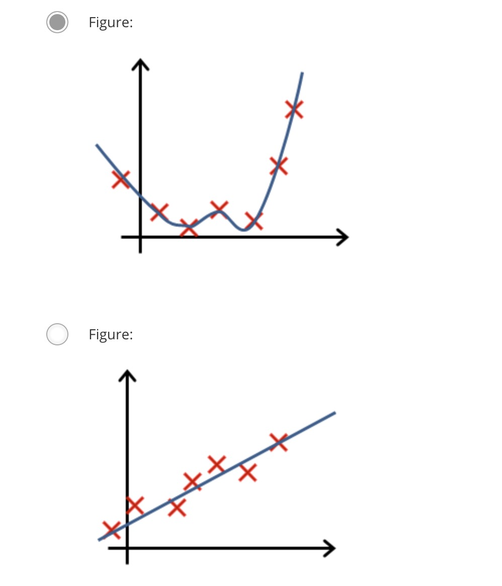
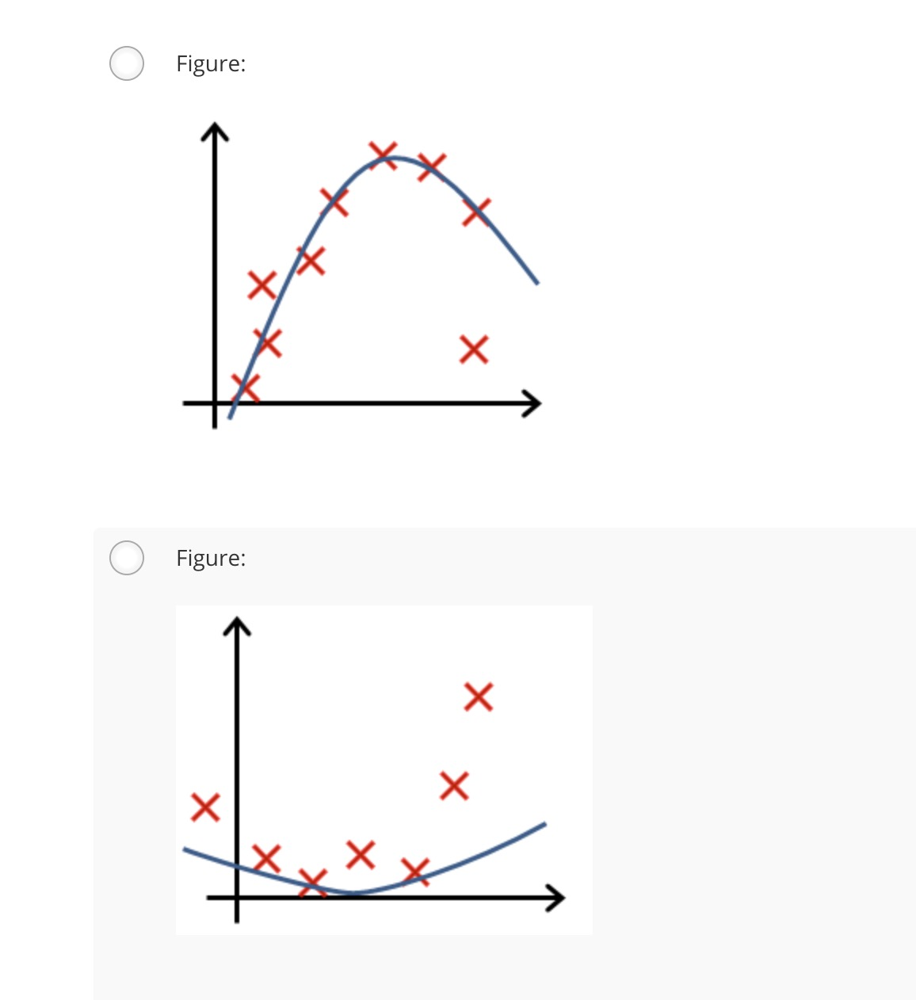
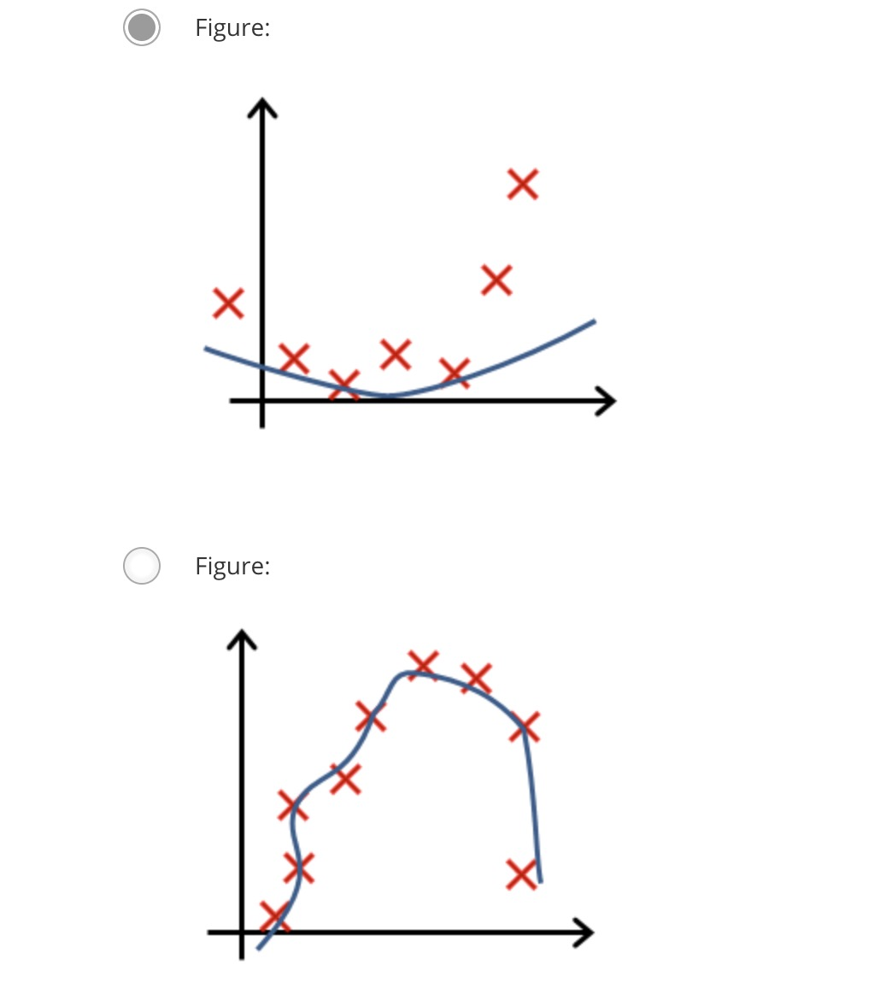
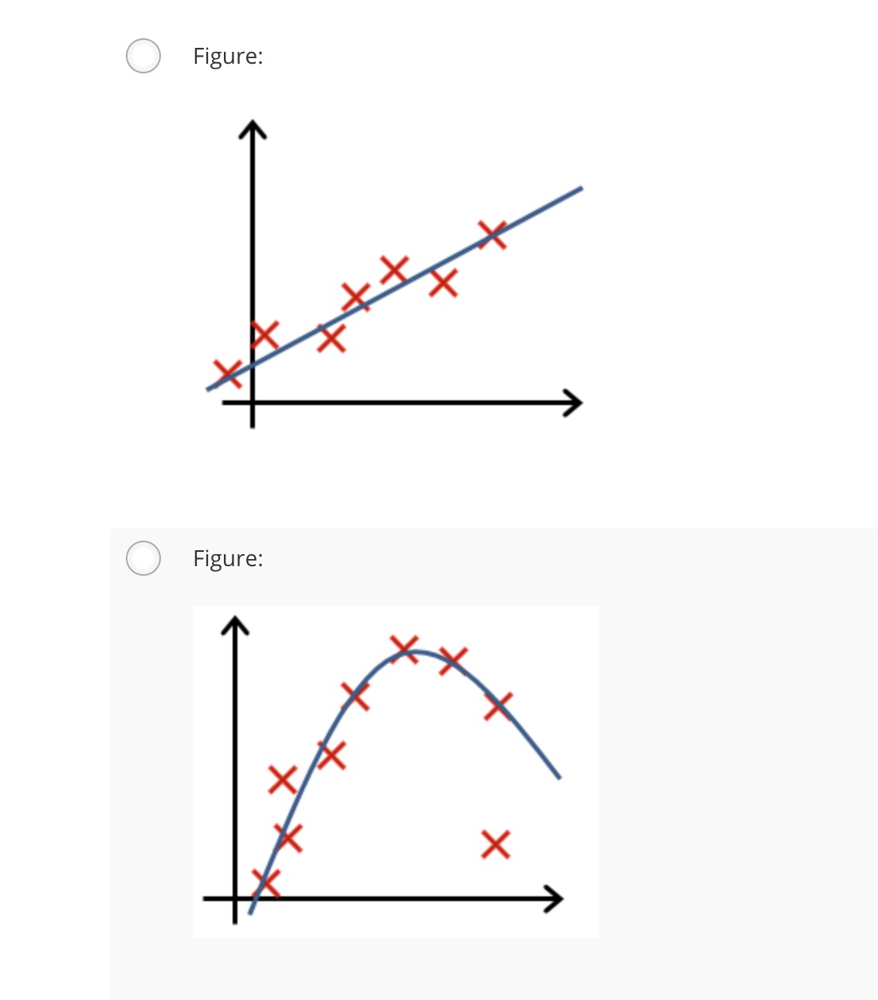

一、You are training a classification model with logistic
regression. Which of the following statements are true? Check
all that apply.

1. Introducing regularization to the model always results in equal or better performance on the training set.
2. Introducing regularization to the model always results in equal or better performance on examples not in the training set.
3. Adding many new features to the model helps prevent overfitting on the training set.
4. Adding a new feature to the model always results in equal or better performance on the training set.

answers: 4

二、Suppose you ran logistic regression twice, once with λ=0, and once with λ=1. One of the times, you got parameters θ=[81.4712.69], and the other time you got
θ=[13.010.91]. However, you forgot which value of λ corresponds to which value of θ. Which one do you think corresponds to λ=1?

answers:2

三、Which of the following statements about regularization are
true? Check all that apply.

1. Using a very large value of λ cannot hurt the performance of your hypothesis; the only reason we do not set λ to be too large is to avoid numerical problems.
2. Because regularization causes J(θ) to no longer be convex, gradient descent may not always converge to the global minimum (when λ>0, and when using an appropriate learning rate α).
3. Because logistic regression outputs values 0≤hθ(x)≤1, its range of output values can only be "shrunk" slightly by regularization anyway, so regularization is generally not helpful for it.
4. Using too large a value of λ can cause your hypothesis to underfit the data.

answers: 4

四、In which one of the following figures do you think the hypothesis has overfit the training set?

五、In which one of the following figures do you think the hypothesis has underfit the training set?

